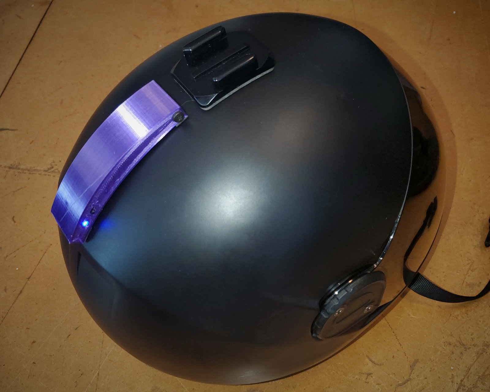
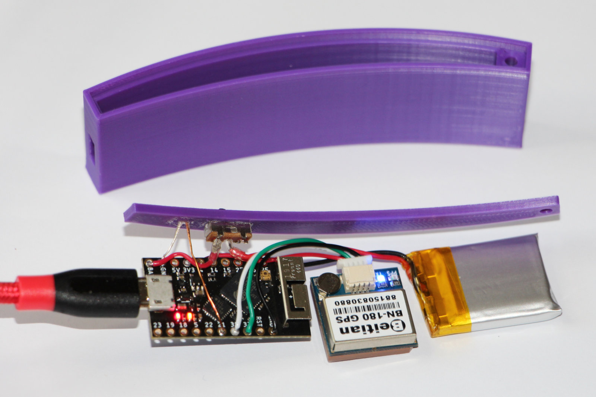

# BASEline Mohawk GPS

[](https://github.com/platypii/Mohawk/actions)
[](https://opensource.org/licenses/MIT)

Mohawk is a helmet mounted wireless GPS for wingsuit, skydive, and BASE jumping.
The key advantages are:

 - Wireless data streaming to BASEline app
 - Aerodynamic shape conforms to most helmets

Mohawk is open source, designed for makers.
Using cheap components, soldering, and a 3D printer, you can make your own Mohawk GPS.



## Components

 - TinyS3 ESP32 microcontroller $25
 - Beitian BN-180 GPS $20
 - 3.7V 200mAh LiPo battery 502025 $8
 - Slide switch
 - LED status light
 - 3D printed case
 - M3 screw

Note: This project originally used the TinoPICO.
It has been upgraded to use the TinyS3 with faster ESP32-S3 processor and USB-C connector.

## Wiring

```
    +-------+
    |35  BAT|-------+
    |37  GND|       |
    |36   5V|       |
    |34   3V|-----+ |
    |9     1|     | o
LED-|8     2|     |  \
+---|7     4|     | o
| +-|6     5|     | |
| | |RST  21|     | |
| | |GND   0|     | |
| | +-------+     | |
| |               | |
| +-------------+ | |
+-------------+ | | |
              | | | |
    +-------+ | | | |
    |GPS    |-+ | | |
    |       |---+ | |
    |      +|-----+ |
    |      -|--o    |
    +-------+       |
                    |
    +-------+       |
    |Batt   |       |
    |      -|--o    |
    |      +|-------+
    |       |
    +-------+
```

## Assembly

Connect the components according to the above schematic.
Use thin guage wire of the appropriate length.



## Firmware

Mohawk firmware runs on small ESP32 dev boards, using the arduino framework. These are super cheap but powerful microcontrollers. PlatformIO is used to manage the software.

### Program the device

Install Visual Studio Code and PlatformIO.
Open the project in the `arduino` directory of this project.
Connect the ESP32 to the computer by USB.
Use the PlatformIO "Upload" function to program the device.
